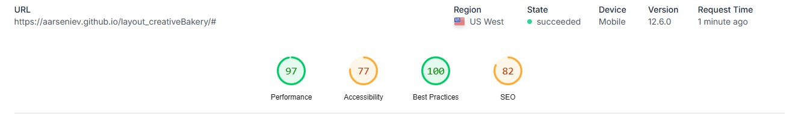

# Creative Bakery Landing Page
<p>Landing page for a Creative Bakery. It showcases various baked goods (cakes, cookies, donuts, croissants) with descriptions and provides ordering functionality via phone contact.</p>
<h1><a href="https://Aarseniev.github.io/creativeBakery-landing/">LIVE DEMO</a></h1>
<h1><a href="https://www.figma.com/design/dY3izAm0Vspsmra4lQWQIP/Bakerlab_FE-students?m=auto&t=obgeXIYI4TEihOVb-6">MOCKUP</a></h1>

# Technologies used
<ul>
  <li>HTML5</li>
  <li>CSS3</li>
  <li>Sass</li>
  <li>BEM methodology</li>
</ul>

# Features Overview
<p>It is implemented using the mobile-first approach. Layout is adaptive and responsive for all screen sizes. </p>
<p>To make the code more structured, avoid code duplication and makes the code easier to maintain and reuse, i used SCSS for styles(mixins, variables etc.) and BEM for class naming. Using variables, mixins etc..</p>
<p>You can see this google lighthouse report below:</p>
<p align="center">
  
</p>

# Launch Instructions
```
git clone https://github.com/Aarseniev/creativeBakery-landing.git
cd project_folder
npm install
npm start
```

# In Conclusion
<p>This project is made to improve my skills in HTML, CSS, SASS, BEM methodology. I used grid to made structure according to layout and flexbox, media queries to build responsive and adaptive landing page from scratch without using JS.</p>

